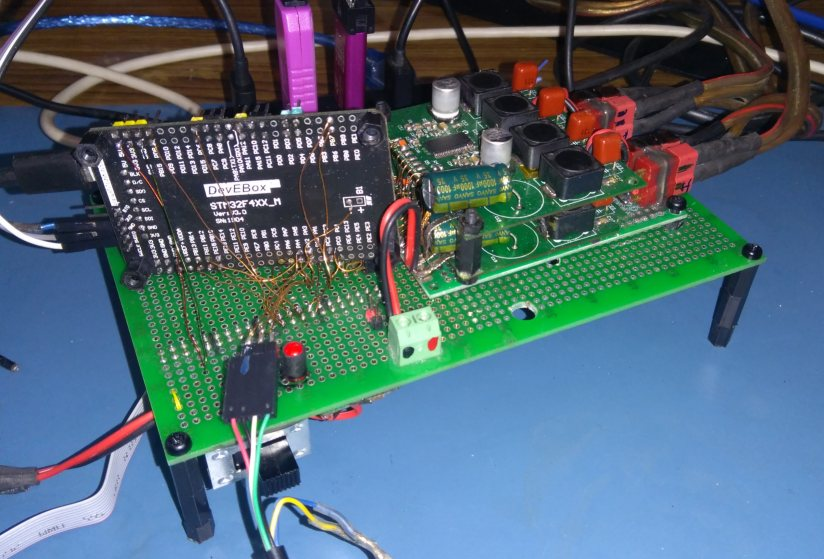
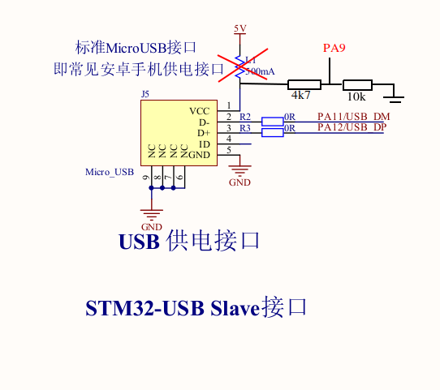
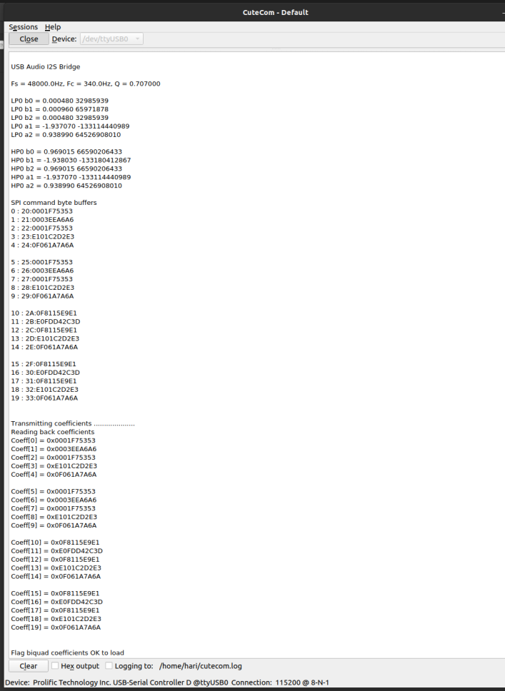
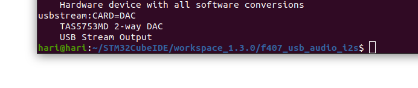
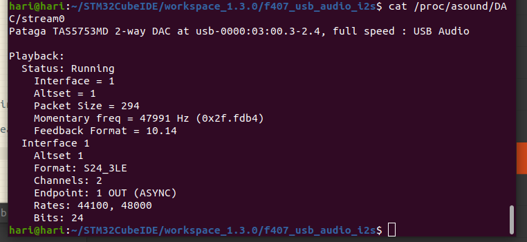

# USB to I2S Audio Power amplifier with stereo 2-way crossover

## Features

* USB Full Speed Class 1 device
* Isochronous with endpoint feedback (3bytes, 10.14 format) to synchronize sampling frequency Fs
* Supports 44.1kHz and 48kHz 24-bit audio streams
* Self-powered USB device with VBUS sensing enabled. 
* USB audio bridge outputs I2S Philips 24/32 data frame to [FPGA 2-way audio crossover filter](https://github.com/har-in-air/FPGA_STEREO_CROSSOVER)
  which generates low pass and high pass outputs for each channel (L, R)
* I2C interface to two stereo TAS5753MD I2S power amplifiers for configuration
* SPI interface to FPGA to configure the audio crossover IIR filter coefficients
* Audio sampling frequency Fs is limited to 48kHz as the TAS5753MD power amplifiers
  cannot handle higher frequencies.

## Credits
* [Dragonman USB Audio project](https://github.com/dragonman225/stm32f469-usbaudio)
* [Endpoint feedback](https://www.microchip.com/forums/m547546.aspx)

## Software Development Environment
* Ubuntu 20.04 AMDx64
* STM32CubeIDE v1.3.0 (makefile project)
* Quartus Prime Lite 19.1 on Ubuntu (VHDL code)

## Test Platform Hardware

* DevEBox STM32F407VGT6 development board
* Waveshare FPGA development board with Altera EP4CE6 FPGA
* TI TAS5753MD stereo I2S input power amplifier x 2

### STM32F407 VBUS sensing modification
A laptop 19.5V 4.7A adapter powers
the stereo amplifiers. A DC-DC converter supplies 5V to the STM32F407 and Altera FPGA boards. 
I desoldered the fuse between  USB VBUS and the 5V net on the STM32F407 board. 

Pin PA9 is used for [VBUS sensing with a couple of resistors.](https://community.st.com/s/article/FAQ-Management-of-VBUS-sensing-for-USB-device-design).

### SPI interface to FPGA for loading audio crossover IIR biquad filter coefficients

The FPGA SPI slave interface is configured with clock polarity 0 (clock = 0 when idle) and 
phase 1 (captures MOSI data on falling edge of SPI clock). Similarly the STM32F407 SPI master captures the MISO data on SPI clock falling edge.

### Output from running 'aplay -L' on Ubuntu terminal

### Output from running 'cat /proc/asound/DAC/stream0' on Ubuntu terminal while a song is playing.
Refer [here](https://github.com/har-in-air/STM32F411_USB_AUDIO_DAC) for configuring PulseAudio, in this case to force resampling to 48kHz 24bit audio.

